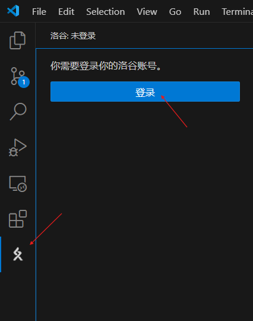
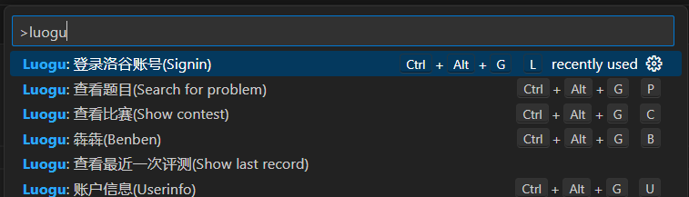
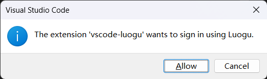
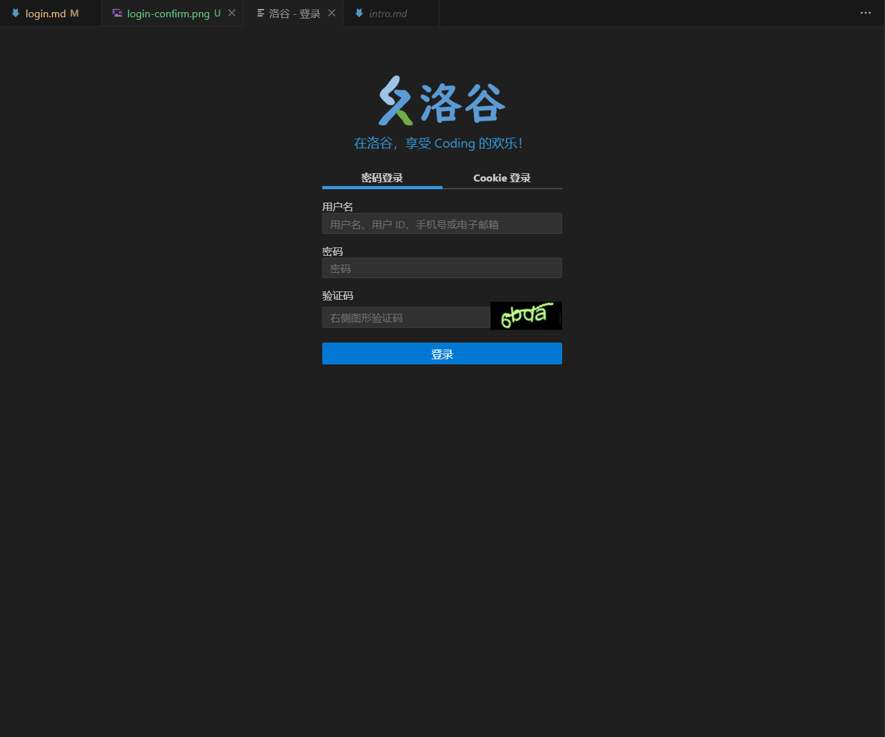
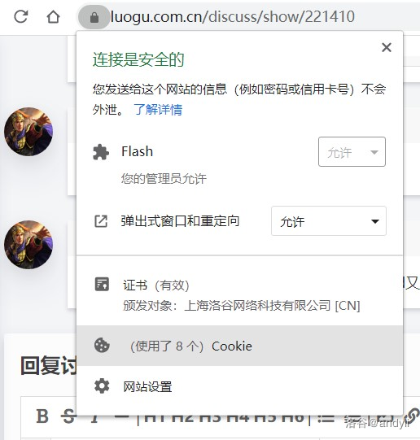
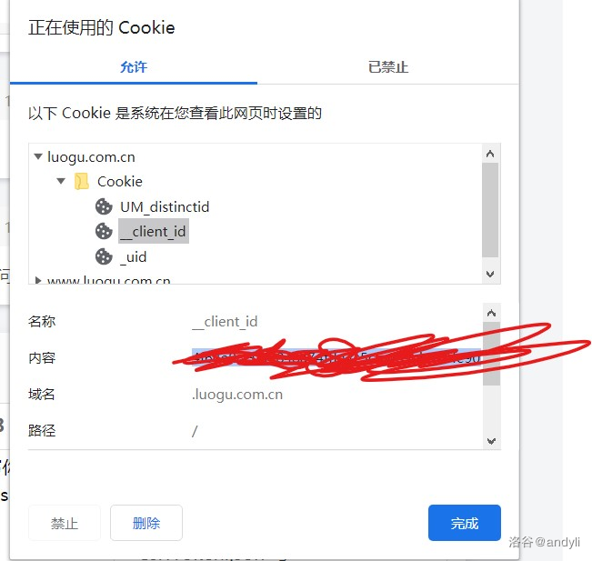

点击侧边栏的洛谷面板里的登录或 `Ctrl+Shift+P` 唤出命令面板输入 `luogu` 后选择 `Luogu: 登录洛谷账号(Signin)`

|方式1|方式2|
|--|--|
|||

在接下来的窗口点击 Allow/允许

在跳出来的标签页中登录洛谷账号

:::tip[Cookies 登录]
在浏览器中登录你的洛谷账号，依次按图中操作查看您的 __client_id 和 _uid：

\
在跳出来的标签页中选择 Cookie 登录\
依次输入 __client_id 和 _uid
:::

