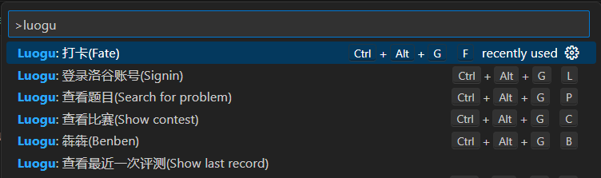
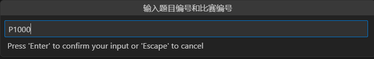
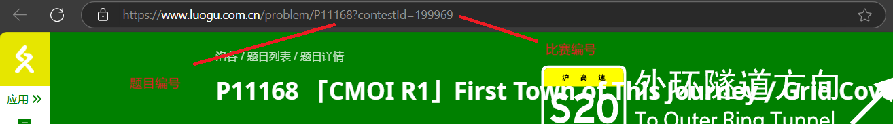
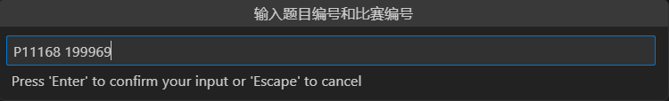
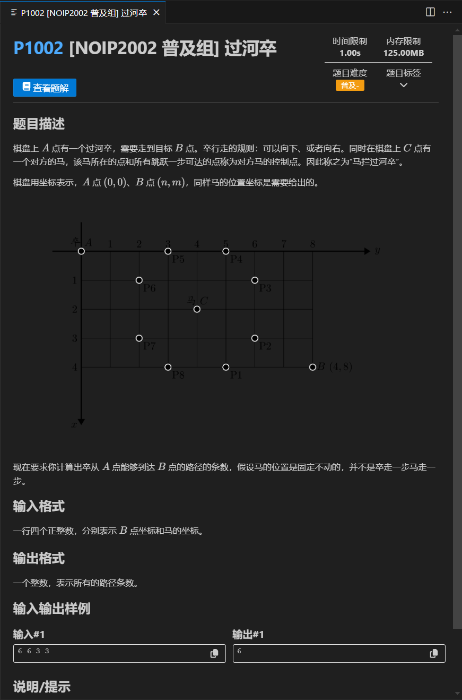

- 查看题目
`Ctrl+Shift+P` 唤出命令面板，输入 `luogu` 后选择 `Luogu: 查看题目(Search for problem)`
- 查看题解
`Ctrl+Shift+P` 唤出命令面板，输入 `luogu` 后选择 `Luogu: 查看题目(Search for solution)`

## 查看题目

:::tip
如果你的文件名刚好是题目编号，那么插件会自动将编号填入输入框
:::
### 查看非比赛题目
输入题目编号后回车

### 查看比赛题目

输入比赛编号加 **空格** 加题目编号后回车

:::note
由于检测写的比较简单，请不要在两侧加入多余的字符(e.g. 空格)
:::
## 查看题解

参照上方说明输入编号
## 题目界面说明

- 点击蓝色的题目编号能跳转到洛谷对应题目的网页
- 将光标移至题目标签的倒三角上能显示题目标签
- 点击查看题解按钮可以在新标签页打开题解
- 点击数据区域的复制图标可以复制数据

