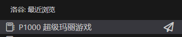
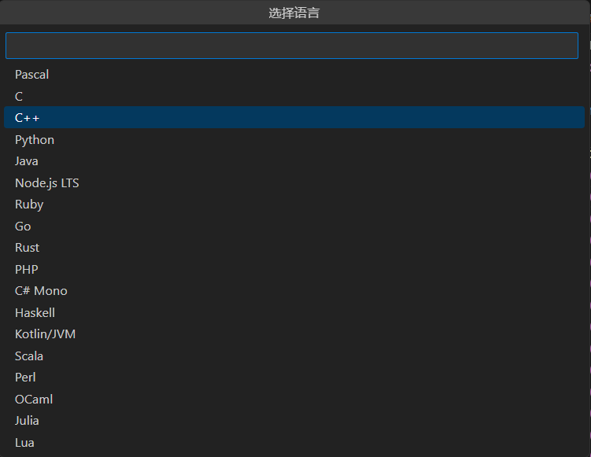
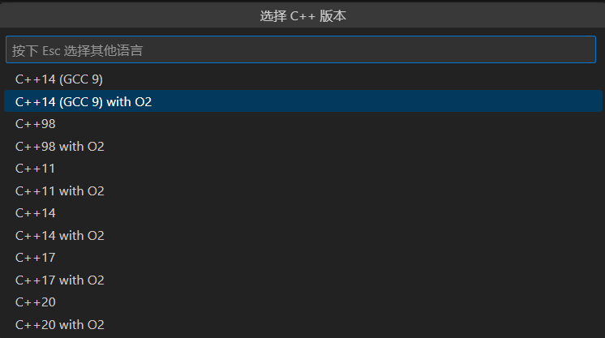

先激活你想要提交的代码的标签页

## 方式一

如果你使用插件打开过题目，可以在侧边栏里的洛谷面板找到题目，点击题目右侧的纸飞机

在跳出来的面板中分别选择语言和语言/编译器（解释器）版本

## 方式二

`Ctrl+Shift+P` 唤出命令面板，输入 `luogu` 后选择 `Luogu: 提交代码(Submit this code)`

如果你的文件名刚好是题目编号，那么插件会自动将编号填入输入框，如果不是，请参照 [查看题目](/view-problem) 中的方法输入题目编号，在跳出来的面板中分别选择语言和语言/编译器（解释器）版本(同上) 即可提交

:::note
比赛题目请附上比赛编号
:::
