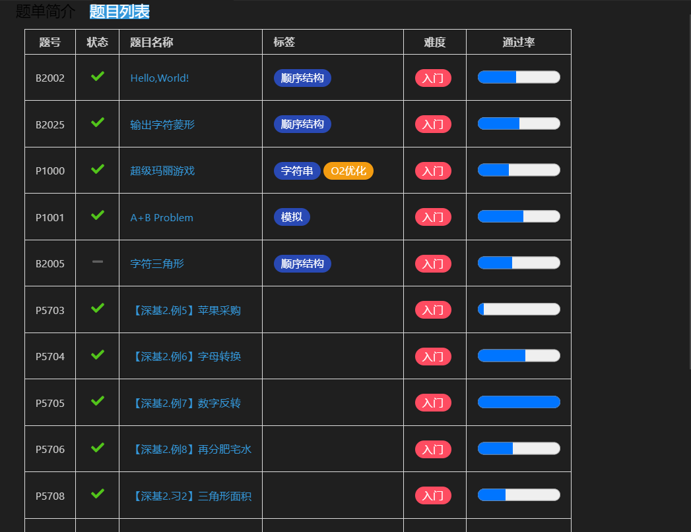

## 查看题单广场
`Ctrl+Shift+P` 唤出命令面板，输入 `luogu` 后选择 `Luogu: 查看题单广场(Show training list)`

## 查看题单
`Ctrl+Shift+P` 唤出命令面板，输入 `luogu` 后选择 `Luogu: 查看题单详情(Show training details)`

### 界面说明
点击题单简介/题目列表会展示对应内容
|||
|--|--|
|||

